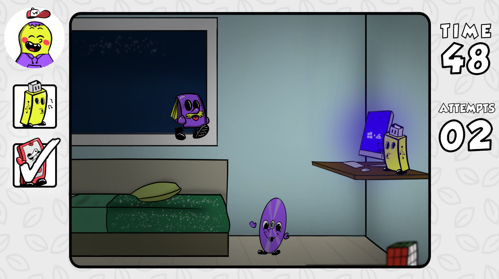

# 🧐 Where's Walter?

A fun and colorful hidden object game made during Global Game Jam 2023.

## 🚀 Download and Play

Download the game (Windows) or play it online (HTML5) from itch.io: https://ciberman.itch.io/where-is-walter

## 🎮 Game Description

"Where's Walter" is a fun and colorful hidden object game that challenges you to find Walter's missing relatives in a lively crowd of characters.

**This is a short game that can be played in 5-10 minutes.**

Featuring four unique levels and procedurally generated characters, the game offers a fresh and entertaining experience with each playthrough.

With its peaceful soundtrack and charming cartoon visuals, "Where's Walter" is perfect for players of all ages.

Join the search for Walter's family and download the game now!

## 📷 Screenshots

## 📝 License

- The code is licensed under the [MIT License](./LICENSE).
- The art and music are licensed under [Creative Commons Attribution-NonCommercial v4.0 International](https://creativecommons.org/licenses/by-nc/4.0/).

## 📜 Credits

**Game Art**
- Barbara Menon
- [Matias Molusko](https://instagram.com/matiasmolusko)
- [Franco Ariel Hernandez](https://francotestudio.rt.gd/)

**User Interface**
- Florencia Malvina

**Music**
- Pedro Puertas

**Programming**
- [Javier "Ciberman" Mora](https://ciberman.net)
- [Franco Ariel Hernandez](https://francotestudio.rt.gd/)
